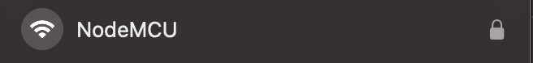

# Project for devices soft and frontend of device webserver


# Device sketch configuration

### Wifi access point
``` c
const char* ssid = "NodeMCU";
const char* password = "12345678";
```
### Endpoint 

``` c
String host = "http(s)://example.com/buttons/GetWithToken?token=";
```

### Pins
You can configure input reset pin
``` c
pinMode(0,INPUT_PULLUP);
```
And output pin that control relay or transistor
``` c
pinMode(4, OUTPUT);
```

### frontend links
Because of memory limitation frontend is stored on the side server.
You should write the links on the <b>index.css</b> and <b>index.js</b> in sketch

``` c
216. index_content += "<script type='module' crossorigin src='http(s)://example.com/index.js'></script><link rel='stylesheet' href='http(s)://example.com/index.css'>";
```

# Frontend configuration

### Host configuration
In .env file write the following line with your host address
```dotenv
VITE_HOST=http(s)://example.com/
```

### Deploy

Then you can build the vue application
``` sh
npm run build
```
and publish <b>index.js</b> and <b>index.css</b> on side server 

# How it works

On startup new device create access point with ssid and password 
specified in sketch.



Then you should open your browser and write in the address bar 
<b>192.168.1.1</b>. You are on the page where you write ssid and password of your home network.
It will saved in EEPROM of the device.


Then restart the device and connect to your home network.
In address bar write the address that was given to device by router.
There you can configure device.


Write your email and password
Then you will see the page where you should
write the name of device.


After setup you should restart device. After restarting device is ready to work.

